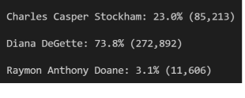

# Election_Analysis
---
## Overview of Election Audit 
* The purpose of this election audit analysis, in my opinion, is twofold: 
1. To teach us how to create a Python script that would deliver the following information, from      raw voting data, when the script is run:
  * Total number of votes cast
  * A complete list of candidates who received votes 
  * Total number of votes each candidate received
  * Percentage of votes each candidate won
  * The winner of the election based on popular vote
2. To teach us how to incorporate file processing into our Python scripts. 
---
## Election-Audit Results
* 369,711 votes were cast in this congressional election, as the following image of my VS Code terminal displays: 

* A breakdown of the number of votes and the percentage of total votes for each county in the precinct is as follows:
  * County: Jefferson
    Total Number of Votes: 38,855
    Percentage of Total Vote: 10.5%
    
  * County: Denver
    Total Number of Votes: 306,055
    Percentage of Total Vote: 82.8%
    
  * County: Arapahoe
    Total Number of Votes: 24,801
    Percentage of Total Vote: 6.7%
    
  * Further, the following image of my 'txt' file output displays the above statistics:
    
* As displayed above, Denver had the largest number of votes out of all the counties. 
* A breakdown of the number of votes and the percentage of total votes that each candidate received can be seen below:
  * Candidate: Charles Casper Stockham
    Total Number of Votes: 85,213
    Percentage of Total Vote Received: 23.0%
    
  * Candidate: Diana DeGette 
    Total Number of Votes: 272,892
    Percentage of Total Vote Received: 73.8%
    
  * Candidate: Raymon Anthony Doane
    Total Number of Votes: 11,606
    Percentage of Total Vote Received: 3.1%
  
  * Moreover, the following image of my VS Code terminal displays the above statistics:
    
    
* As shown above, Diana DeGette won the election with a whopping 272,892 total votes, accounting for an even more impressive 73.8% of the total votes.
---
## Election-Audit Summary
### Business Proposal to Election Commission
* This script can be modified in a vast number of ways to make it the perfect script for any election. For example:
  1. This script can be modified to be used for a Federal election: 
   * Lets say there was a country that assigned each county a certain amount of 'electoral points     based on the percentage of the total population that a certain county makes up. (as many           countries do). For example, lets say 'Broward' county accounts for 65% of the population of a     country. Further, this imaginary country's electoral system has decided to assign 1 electoral     point to each county for every 5% of the population that they house (assuming no county holds     less than 5%). Thereby, Broward county would receive 13 electoral points, that would be           assigned to its winning party. This script could be modified to account for this variable         adding another 'if statement' that would assign Broward its proportionally correct amount of       electoral points (based on its percentage of the country's population) and then assign those       points to the winning party. Lastly, the modified script would be able to sum the                 electoral points to output which party has won the Federal election and provide a breakdown by     county.
  
  2. Voting Demographic Breakdown:
   * Further, lets say you wanted the script to output a voting demographic breakdown of the         election. This script can be modified to do this, given all the demographic data of each voter     was input by them and added to our raw data. If this were true, this script would be able to       output any social/economical (etc.) demographic breakdown using same stastical summarization       methods that are already present in this script.

    
